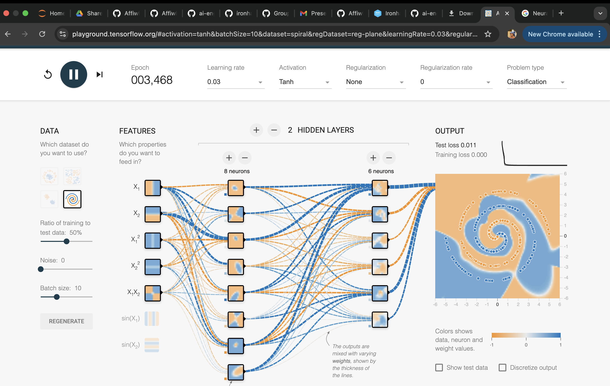

# Challenge 2: Tensorflow Hyperparameter Tuning

## Getting Started

From the lesson and Challenge 1 you should have noticed that understanding the concepts in neural network analysis such as *learning rate*, *epoch*, *optimizer*, *loss function* and so on is essential for you to optimize the neural network models you build. In this challenge you will study several learning pieces that discuss the hyperparameters in Tensorflow. 

**[Neural Networks: Structure](https://developers.google.com/machine-learning/crash-course/introduction-to-neural-networks/anatomy)**

**[Understanding Deep Learning with TensorFlow Playground](https://medium.com/@andrewt3000/understanding-tensorflow-playground-c20cdb7a250b)**

After that, complete [this exercise](https://developers.google.com/machine-learning/crash-course/introduction-to-neural-networks/playground-exercises) on tuning the Tensorflow hyperpamameters in the [Tensorflow Playground](https://playground.tensorflow.org/).

Finally, using what you have learned, try tuning the hyperparameters for the spiral dataset in order to reach training and test loss <0.05 as shown in the following:

After you're done, submit a screenshot of your Playground including the following information:

* Epoch: 3,468
* Learning rate: 0.03
* Activation function: Tanh
* Features included: X₁, X₂, X₁², X₂², X₁X₂
* Hidden layers and neurons: 2 hidden layers (8 + 6 neurons)
* Test and training loss: 0.011 and 0.000 respectively

**Do not google for the end solution!**
